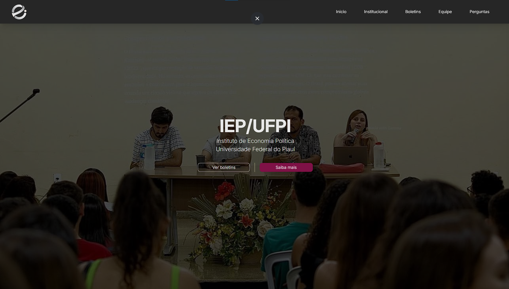
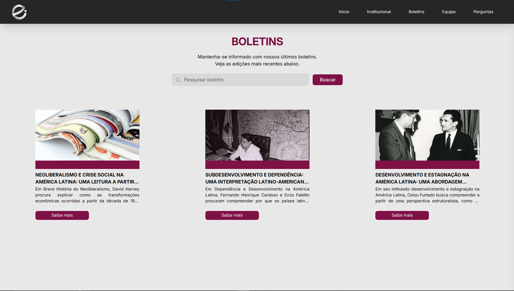
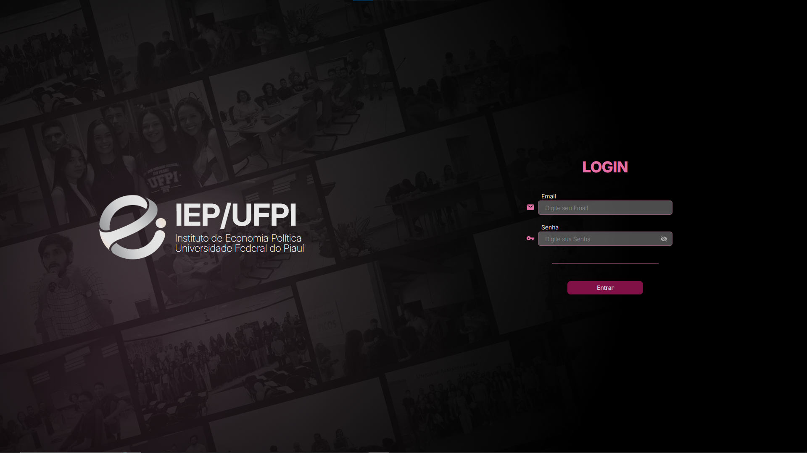
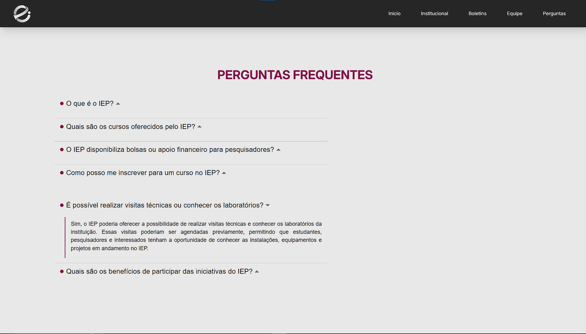

<h1>🏛️ IEP / UFPI</h1>
<h3>Instituto de Economia Política da Universidade Federal do Piauí</h3>

 

**Acesse o projeto online:** 
👉 **[https://iep-ufpi.vercel.app/](https://iep-ufpi.vercel.app/)**

---

## 📖 Sobre o Projeto

O **IEP/UFPI** é a plataforma digital oficial do **Instituto de Economia Política** da Universidade Federal do Piauí. Mais do que um site, é uma **vitrine do conhecimento** produzido pelos pesquisadores e estudantes do IEP.

Antes, materiais acadêmicos, análises e boletins poderiam ficar fragmentados ou de difícil acesso para o público externo. O projeto resolve esse problema atuando como um hub centralizado, reunindo num único espaço acessível e moderno toda a produção, notícias e dados institucionais do Instituto.

Esse projeto é destinado a estudantes acadêmicos, pesquisadores, professores, profissionais de economia e a sociedade em geral (com foco no estado do Piauí e no Brasil) que buscam análises profundas, dados concretos e contato direto com a academia. 

A motivação principal da construção desse projeto foi democratizar o acesso à análise econômica e política. Acreditamos que a produção acadêmica não pode ficar restrita aos muros da universidade, e por isso desenvolvemos este canal direto, transparente e acolhedor entre o instituto e a sociedade.

 

  

 

---

## ✨ Funcionalidades

- **📰 Boletins Informativos:** Leitura e visualização de publicações periódicas com análises econômicas e políticas (editadas via rich-text diretamente na plataforma).
- **👥 Perfil da Equipe:** Conheça os pesquisadores, professores e estudantes que formam o IEP.
- **❓ Perguntas Frequentes:** Dúvidas comuns resolvidas para orientar o público.
- **📬 Formulário de Interesse:** Canal direto para quem quer colaborar ou se juntar ao instituto.
- **🔐 Área Restrita / Sistema Administrativo:** Autenticação e painel para gerenciamento interno das publicações e dados institucionais.

 

  

 

---

## 💻 Tecnologias Utilizadas

O projeto foi construído pensando em escalabilidade, segurança e fácil manutenção, adotando tecnologias de ponta em seu ecossistema.

### 🎨 Front-end
- **React.js & Vite:** Para criar uma interface veloz e componentizada.
- **Tailwind CSS & Material UI (MUI):** Para uma estilização responsiva, bonita e rápida, mesclando classes utilitárias e componentes prontos.
- **Tiptap:** Editor de rich-text amigável para a criação e formatação dos boletins informativos.
- **React Router:** Para o gerenciamento ágil de rotas no cliente.
- **Axios:** Cliente HTTP para comunicação com o backend.

### ⚙️ Back-end
- **NestJS:** Framework Node.js robusto, com forte uso de tipagem, injeção de dependências e arquitetura modular.
- **Prisma ORM:** Para interagir com o banco de dados de maneira rápida, segura e com tipagem estática.
- **JWT & Bcrypt:** Para assegurar rotas privadas e manter a integridade de senhas e sessões de usuários.
- **Multer:** Para o upload e gerenciamento de arquivos de mídia/imagens.

### 🗄️ Banco de Dados
- **PostgreSQL (via Supabase):** Banco de dados relacional poderoso, utilizando a infraestrutura do Supabase para armazenamento e confiabilidade.

 

  

 

---

## 🏗️ Decisões Técnicas (Por que foi construído assim?)

Para garantir que a equipe do IEP, mesmo sem amplo conhecimento em desenvolvimento, tivesse uma plataforma estável no futuro, tomamos as seguintes decisões arquiteturais:

1. **Separação de Responsabilidades (API REST):** A escolha por separar o Front-end e o Back-end em repositórios/pastas distintas (arquitetura cliente-servidor) garante que possamos escalar cada parte individualmente, trocar as tecnologias de front sem alterar as regras de negócio ou mesmo criar um app mobile amanhã consumindo a mesma API.
2. **NestJS no Backend:** Escolhemos o NestJS devido a sua arquitetura baseada em módulos (inspirada fortemente no Angular). Isso facilita a manutenção da base de código e obriga uma estrutura limpa (Controllers, Services, Modules).
3. **Tipagem com TypeScript:** Aplicado de ponta a ponta (Front e Back). Evita erros de tempo de execução, documenta o código de forma nativa e acelera muito a manutenção.
4. **Editor Tiptap Integrado:** Em vez de pedir para os autores escreverem publicações de forma complexa, o Tiptap possibilita uma experiência de formatação interativa e fluida, facilitando a edição dos boletins.

 

  

 

---

## 👨‍💻 Autores

- **Augusto Almondes** (FullStack Developer) - [GitHub](https://github.com/AugustoAlmondes)
- **Viviany da Silva Araújo** (Front-end Developer) - [GitHub](https://github.com/VivySilva)

---

## ©️ Direito Autoral

Todos os direitos reservados ao **Instituto de Economia Política - Universidade Federal do Piauí (UFPI)** e aos autores do projeto. A reprodução parcial ou total dos boletins depende de citação da fonte original.
